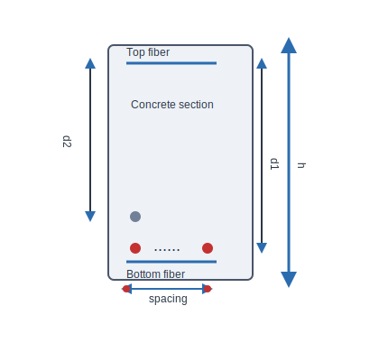

# Reinforced Concrete Cross-Section Calculator

This Python application calculates the effective depth (d) of a reinforced concrete cross-section and the required bottom reinforcement area (As) based on given parameters.

## Author
Natalia

## Characteristic

This calculator assumes a rectangular reinforced concrete cross-section with width `b` and height `h`. The concrete is typically C30/37 class, and the steel reinforcement is S500 grade.

### Concrete Properties:
- `fck`: Characteristic compressive strength of concrete (cylinder strength at 28 days).
- `fcd`: Design compressive strength of concrete, calculated as `fcd = fck / γc`, where `γc` is the partial safety factor for concrete (usually 1.5).
- `fctm`: Mean tensile strength of concrete, estimated as `fctm = 0.3 × (fck)^{2/3}` for fck in MPa.

### Steel Properties:
- `fyk`: Characteristic yield strength of steel reinforcement.
- `fyd`: Design yield strength of steel, calculated as `fyd = fyk / γs`, where `γs` is the partial safety factor for steel (usually 1.15).

## Calculation for Effective depth

Diagram:

The effective depth `d` is the distance from the extreme compression fiber to the centroid of the tensile reinforcement. For a multi-row reinforcement layout, it can be estimated as:

`d = h - cover - 0.5*dia - (rows - 1)*spacing`

Where:
- `h` = total cross-section height
- `cover` = concrete cover to the first layer of reinforcement
- `dia` = rebar diameter
- `rows` = number of reinforcement rows
- `spacing` = vertical spacing between rows

Diagram:



For two rows of reinforcement, `d1` is the effective depth to the centroid of the first row and `d2` is the effective depth to the centroid of the second row. The input parameters shown are:
- `h` = section height
- `cover` = concrete cover
- `dia` = bar diameter
- `spacing` = distance between row centroids
- `rows` = number of reinforcement rows

Calculation steps:
1. Subtract the concrete cover from the total height.
2. Subtract half the rebar diameter to reach the centroid of the first row.
3. Subtract the additional spacing for each extra row beyond the first.

Calculation steps:
1. Subtract the concrete cover from the total height.
2. Subtract half the rebar diameter to reach the centroid of the first row.
3. Subtract the additional spacing for each extra row beyond the first.

Example:
- `h = 700 mm`
- `cover = 30 mm`
- `dia = 12 mm`
- `rows = 2`
- `spacing = 35 mm`

Then:
`d = 700 - 30 - 0.5*12 - (2 - 1)*35 = 700 - 30 - 6 - 35 = 629 mm`

## Bar Spacing and Row Calculations

### Minimum Spacing Requirements:
- For bars ≤ 20mm diameter: spacing ≥ 20mm
- For bars > 20mm diameter: spacing ≥ bar diameter
- This ensures proper concrete consolidation around reinforcement
- Horizontal spacing is set automatically by the calculator as `max(20mm, diameter)`

### Maximum Bars Per Row:
`max_bars = ((beam_width - 2×cover - diameter) ÷ (diameter + spacing)) + 1`

### Minimum Rows Required:
`min_rows = ceil(total_bars_needed ÷ max_bars_per_row)`

Example for 400mm beam, 30mm cover, 20mm spacing:
- Available width = 400 - 2×30 = 340mm
- For 20mm bars: max_bars = ((340-20)÷(20+20))+1 = (320÷40)+1 = 8+1 = 9 bars/row
- For 7 bars needed: min_rows = ceil(7÷9) = 1 row

## Features

- Calculates effective depth considering multiple rebar rows
- Computes required reinforcement area using Eurocode 2 formulas
- Calculates total number of bars needed and their distribution per row
- Automatically sets horizontal bar spacing to `max(20mm, diameter)`
- Automatically optimizes row usage to minimum required (prioritizes 1-2 rows)
- Provides detailed comparison of bar requirements for different diameters (12mm, 16mm, 20mm, 25mm, 28mm, 32mm)
- Flags preferred solutions that use 1-2 rows maximum
- Includes warnings for spacing constraints
- Handles singly reinforced sections

## Usage

Run the script and provide the following inputs when prompted:

1. Rebar diameter (mm)
2. Number of rows
3. Cross-section width b (mm)
4. Cross-section height h (mm)
5. Concrete cover (mm)
6. Spacing between rows (mm)
7. Bending moment M (kNm)
8. Steel yield strength fy (MPa)
9. Concrete characteristic strength fck (MPa)

Example:
```
Enter rebar diameter (mm): 12
Enter number of rows: 2
Enter cross-section width b (mm): 400
Enter cross-section height h (mm): 700
Enter concrete cover (mm): 30
Enter spacing between rows (mm): 35
Using horizontal bar spacing = 20 mm (max(20, diameter)).
Enter bending moment M (kNm): 517
Enter steel yield strength fy (MPa): 500
Enter concrete characteristic strength fck (MPa): 30
```

Output:
```
Effective depth d = 640.50 mm
Required reinforcement area As = 1981.37 mm²
Total number of bars needed: 18
Displayed rows: 2
Bars per row:
  Row 1: 9 bars
  Row 2: 9 bars

One-row capacity: 11 bars
Two-row capacity: 22 bars
All bars fit in two rows.

Detailed comparison for different rebar diameters:

12mm diameter:
  Total bars needed: 18
  Displayed rows: 2
  Actual rows needed: 2
  Bars per row: 9, 9
  Width calculation (available: 340mm):
    1 bars: 12mm ✓
    2 bars: 44mm ✓
    3 bars: 76mm ✓
    4 bars: 108mm ✓
    5 bars: 140mm ✓
    6 bars: 172mm ✓
    7 bars: 204mm ✓
    8 bars: 236mm ✓
    9 bars: 268mm ✓
    10 bars: 300mm ✓
    11 bars: 332mm ✓
    12 bars: 364mm ❌
  ✓ Preferred solution (1-2 rows)

16mm diameter:
  Total bars needed: 10
  Displayed rows: 1
  Actual rows needed: 1
  Bars per row: 10
  Width calculation (available: 340mm):
    1 bars: 16mm ✓
    2 bars: 52mm ✓
    3 bars: 88mm ✓
    4 bars: 124mm ✓
    5 bars: 160mm ✓
    6 bars: 196mm ✓
    7 bars: 232mm ✓
    8 bars: 268mm ✓
    9 bars: 304mm ✓
    10 bars: 340mm ✓
    11 bars: 376mm ❌
  ✓ Preferred solution (1-2 rows)

20mm diameter:
  Total bars needed: 7
  Displayed rows: 1
  Actual rows needed: 1
  Bars per row: 7
  Width calculation (available: 340mm):
    1 bars: 20mm ✓
    2 bars: 60mm ✓
    3 bars: 100mm ✓
    4 bars: 140mm ✓
    5 bars: 180mm ✓
    6 bars: 220mm ✓
    7 bars: 260mm ✓
    8 bars: 300mm ✓
    9 bars: 340mm ✓
    10 bars: 380mm ❌
  ✓ Preferred solution (1-2 rows)

25mm diameter:
  Total bars needed: 5
  Displayed rows: 1
  Actual rows needed: 1
  Bars per row: 5
  Width calculation (available: 340mm):
    1 bars: 25mm ✓
    2 bars: 75mm ✓
    3 bars: 125mm ✓
    4 bars: 175mm ✓
    5 bars: 225mm ✓
    6 bars: 275mm ✓
    7 bars: 325mm ✓
    8 bars: 375mm ❌
  ✓ Preferred solution (1-2 rows)

28mm diameter:
  Total bars needed: 4
  Displayed rows: 1
  Actual rows needed: 1
  Bars per row: 4
  Width calculation (available: 340mm):
    1 bars: 28mm ✓
    2 bars: 84mm ✓
    3 bars: 140mm ✓
    4 bars: 196mm ✓
    5 bars: 252mm ✓
    6 bars: 308mm ✓
    7 bars: 364mm ❌
  ✓ Preferred solution (1-2 rows)

32mm diameter:
  Total bars needed: 3
  Displayed rows: 1
  Actual rows needed: 1
  Bars per row: 3
  Width calculation (available: 340mm):
    1 bars: 32mm ✓
    2 bars: 96mm ✓
    3 bars: 160mm ✓
    4 bars: 224mm ✓
    5 bars: 288mm ✓
    6 bars: 352mm ❌
  ✓ Preferred solution (1-2 rows)
```

*Note: If spacing < max(20mm, diameter), a warning will be displayed for proper concrete consolidation.*

## Requirements

- Python 3.x

## Notes

- Assumes equal reinforcement area per row
- Bars are distributed evenly across rows (with extras in lower rows)
- Always displays at most 2 rows; 3+ rows are informational
- Always checks one-row fit first, then two-row fit, before adding more rows
- 1-row capacity = max bars per row
- 2-row capacity = 2 × max bars per row
- If `total_bars > two_row_capacity`, the calculator reports that 3 rows would be needed, but it still only outputs 2 rows for the design summary
- Row calculation: if 1 row is enough, use 1; if 2 rows are enough, use 2; otherwise show 2 rows and report the actual rows needed
- Max bars per row = ((beam_width - 2×cover - diameter) ÷ (diameter + spacing)) + 1
- Spacing between bars must be ≥ max(20mm, diameter) for proper concrete consolidation
- Includes basic check for maximum bars that fit in beam width
- Shows detailed comparison for common rebar diameters (12mm to 32mm)
- For k > 0.167, compression reinforcement is required (not calculated here)
- Units: mm for lengths, MPa for strengths, kNm for moment